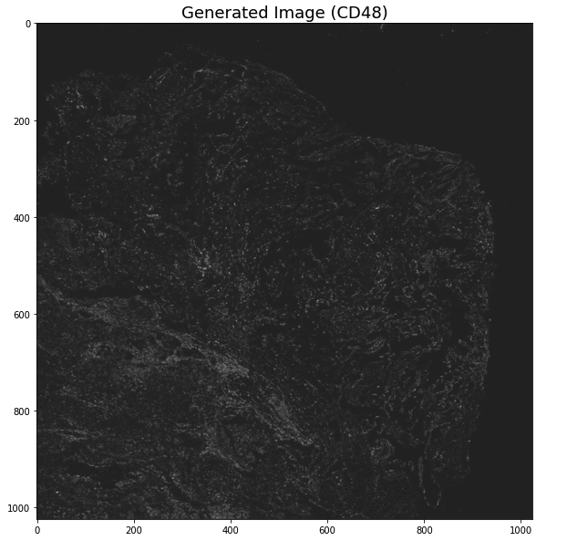

# A SSIM Guided cGAN Architecture For Clinically Driven Generative Image Synthesis of Multiplexed Spatial Proteomics Channels


## Environments
This code has been tested on Ubuntu 20.04 with a Nvidia GeForce A100-SXM-80GB GPU, CUDA Version 11.0, Python 3.9.7, and PyTorch 1.9.0

## Prerequisites
Linux or macOS
Python 3
NVIDIA GPU + CUDA cuDNN

Install the other required libraries
```sh
pip install -r requirements.txt
```
## Training
```sh
python3 train.py --data_type 16 --batch_size 4 --n_epochs 250 \
--n_downsample 2 --n_residual 2 --n_df 10 --n_D 3 \ 
--tb_logger_name tb_logger_name --dataset_name 'Directory for saving images while Training and Testing' \
--raw_data_dir 'Data directory for images [consist of source and target channels ' \ 
--channel_ids 'the channel id description for choosing source channels and target channels in json file'
```

Demo Run 
```sh
python3 train.py --data_type 16 --batch_size 4 --n_epochs 250 --n_downsample 2 --n_residual 2 --n_df 10 --n_D 3 --tb_logger_name tb_logger_name --dataset_name test --raw_data_dir Data/ --channel_ids cross_check_train_hub_6_2.json
```
For inference
```sh
python test.py --trained_model_dir checkpoints/test/Model/epoch=1699-step=3400.ckpt --channel_ids cross_check_train_hub_6_2_test.json --raw_data_dir Data/
```

To provide channels which channel to use as source and which channels to use as target, you have to provide a json like below
```sh
channel_ids_json = {"uid": "1", "source_channel_ids": [0, 2, 1, 5, 3, 4], "target_channel_ids": [7, 6]} 
```

## Options
For more options see the Pix2PixHD_Options.py file

## Images from Inference



